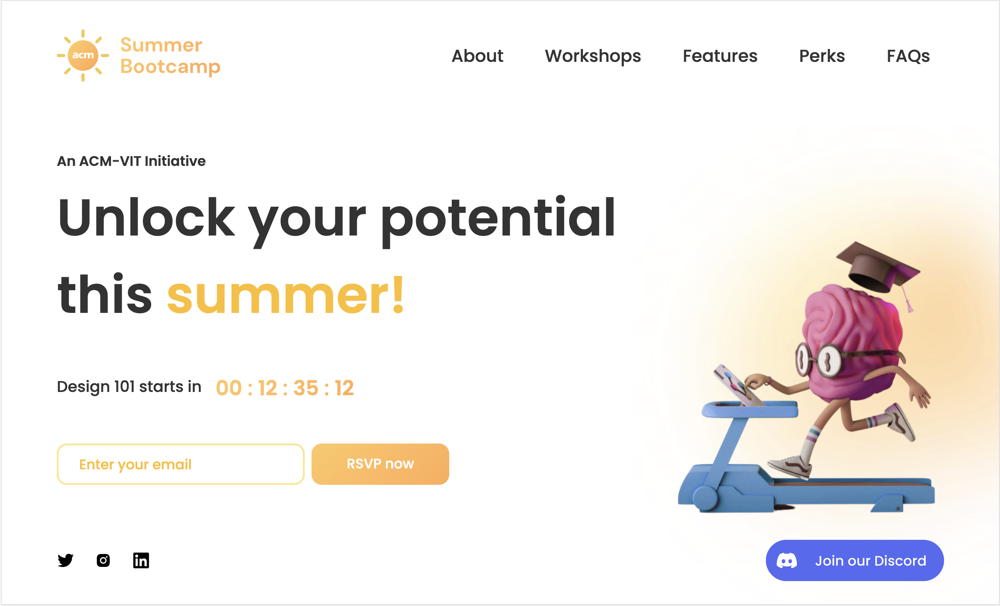
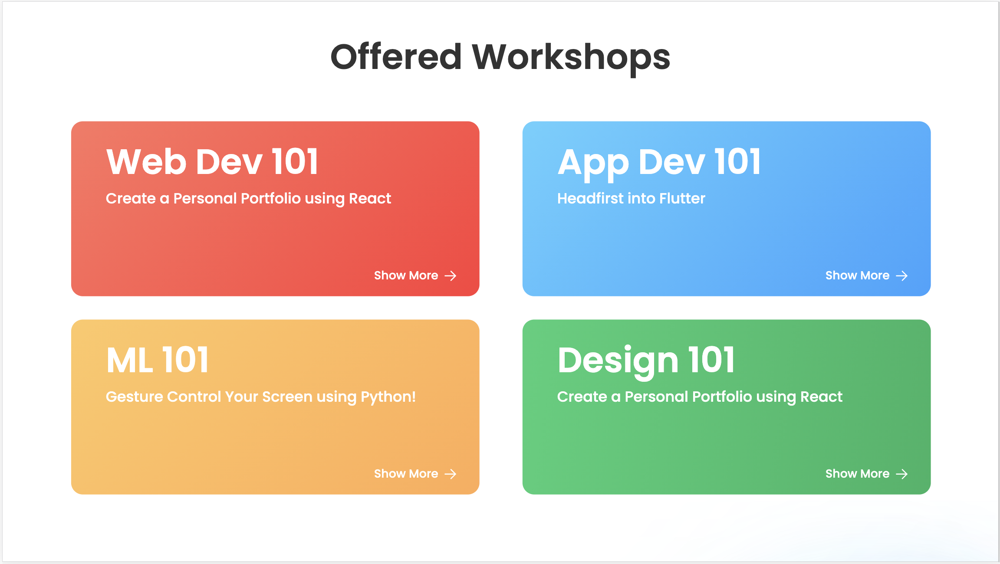

<!--  -->
<p align='center'>
  <a href="https://github.com/ACM-VIT/bootcamp-2021-frontend
  ">
  
  </a>

  <h1 align="center"> Summer Bootcamp Website </h1>

  <p align="center"> 
  It is a two-week-long Bootcamp with workshops and mentor guided projects.
  </p>
</p>
<p align="center">
<a href="https://bootcamp.acmvit.in/"><strong>Visit Us »</strong></a>
</p>

<p>
  <a href="https://acmvit.in/" target="_blank">
    
  </a>
    <!-- Uncomment the below line to add the license badge. Make sure the right license badge is reflected. -->
    <!--  -->
    <!-- forks/stars/tech stack in the form of badges from https://shields.io/ -->
</p>

---

ACM Summer Bootcamp is an all-immersive Bootcamp for novices and pros alike. We aim to provide you with a hands-on learning experience through our accomplished student mentors. Through project-based learning, we will help you get started in 4 exciting domains: Web Development, App Development, Machine Learning and Design.

---

## Screenshots





---

## Usage

<!-- How To, Features, Installation etc. as subheadings in this section. example-->

To setup project locally, fork the repository.

```
# Install Packages
npm i

# Build Script
npm run build

# Run the server
npm start
```

---

## Authors

**Authors:**
[Anish Mittal](https://github.com/ANISH0309),
[Likhit Ajeesh](https://github.com/Likkiii)

<!-- **Contributors:** Generate contributors list using this link - https://contributors-img.web.app/preview -->
